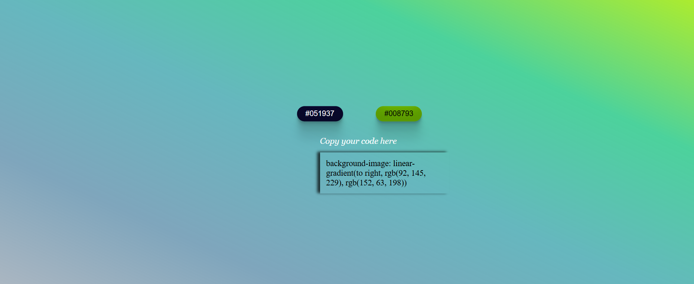

# 🎨 Project Gradient

This is a simple web project that generates linear gradient backgrounds using randomly generated hex color codes. Users can click on buttons to change the gradient and copy the corresponding CSS code to use in their own designs.

## 🌈 Features

- Clickable buttons to generate random hex colors.
- Live preview of the gradient background.
- CSS code snippet display for easy copying.
- Responsive and centered layout.
- Interactive clipboard functionality for copying CSS.

## 🛠️ Tech Stack

- HTML5
- CSS3 (with linear gradients and flexbox)
- JavaScript (DOM manipulation & clipboard API)

## 📷 Preview



## 🚀 Getting Started

Clone the repository or download the HTML file directly:

```bash
git clone https://github.com/your-username/projectGradient.git
cd projectGradient
